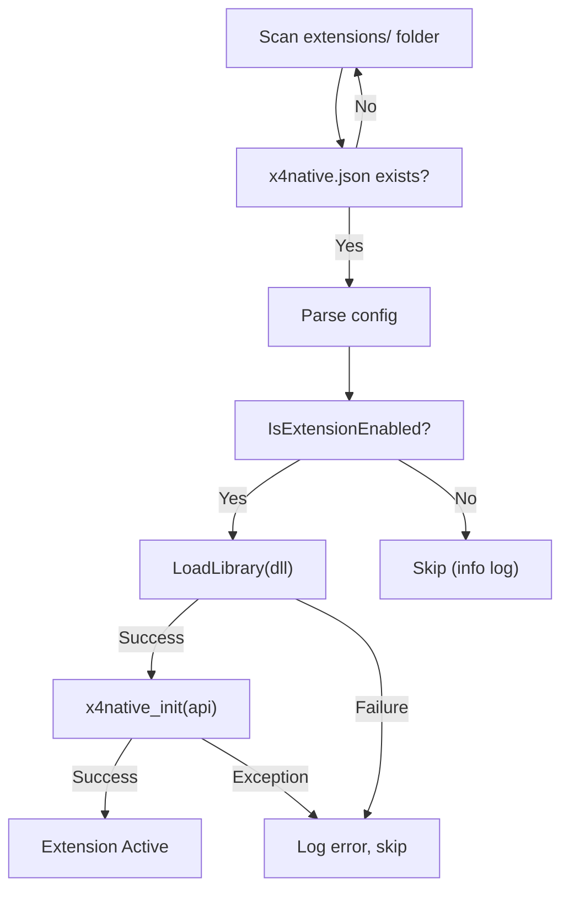

# X4Native — Internal Subsystems

## Event System

The event system is a **general-purpose bidirectional event bus**. Any event name can flow in any direction — Lua→C++, C++→Lua, or C++→C++. The bus is implemented as a pub/sub system in the core DLL (`EventSystem`), with two bridges in the proxy that connect it to X4's Lua/MD layer.

```
    MD / Lua                    Event Bus (core DLL)              Extension DLLs
    ────────                    ────────────────────              ──────────────
  raise_lua_event ───────►  EventSystem::fire(name, data) ◄────── subscribe()
  RegisterEvent              subscribe / unsubscribe               raise_event()
  SetScript                         │
                          Lua Bridge (proxy DLL)
                          inbound:  Lua → raise_event
                          outbound: raise → CallEventScripts
```

**Key principle:** The event bus doesn't know or care which events exist. Extensions subscribe to any name. The Lua bridge is a general transport.

### Built-in Events

| Event | Source | Direction |
|-------|--------|-----------|
| `on_game_loaded` | MD cue (`player.age ≥ 3s`) → Lua → DLL | Lua→C++ |
| `on_game_save` | MD `event_game_saved` → Lua → DLL | Lua→C++ |
| `on_ui_reload` | Lua bootstrap on re-execution | Lua→C++ |
| `on_before_reload` | Core `impl_prepare_reload()` | C++ internal |
| `on_frame_update` | Lua `SetScript("onUpdate")` → DLL | Lua→C++ |

### C++→Lua Bridge

The proxy calls X4's `CallEventScripts` directly — the same dispatch path the game engine uses for `<raise_lua_event>` from MD. Lua listeners can't tell whether an event came from MD or C++.

```
api->raise_lua_event("mymod.alert", "data")
    → proxy_raise_lua_event():
        getfield(GLOBALSINDEX, "CallEventScripts")
        pushstring(name), pushstring(param)
        pcall(2, 0, 0)
    → all RegisterEvent("mymod.alert", fn) listeners fire
```

### Lua→C++ Bridge

Table-driven forwarding in `x4native.lua`. Extensions can dynamically register bridges at init time via `x4n::bridge_lua_event(lua_event, cpp_event)`.

### Event Naming Conventions

| Scope | Pattern | Example |
|-------|---------|---------|
| C++ bus | `on_<name>` | `on_game_loaded` |
| Framework Lua | `x4native.<name>` | `x4native.game_loaded` |
| Extension Lua | `<modname>.<name>` | `tradealert.price_changed` |

### Thread Safety

The C++ event bus uses `std::mutex` with snapshot-copy-before-dispatch. Lua is single-threaded (UI thread). `raise_lua_event` must only be called from the UI thread — all current events satisfy this.

### Subscriptions Across Save Loads

Subscription IDs are **not stable** across save loads. Extensions re-subscribe during `x4native_init()` which runs on each save load cycle.

---

## Function Hooking

### Design

Inspired by Harmony's patching model (.NET), adapted for native x64:

| Concept | X4Native | Notes |
|---------|----------|-------|
| Prefix | `hook_before` | Runs before original. Can modify args, skip original. |
| Postfix | `hook_after` | Runs after original. Can read/modify return value. |
| Priority | Extension load order | `priority` in `x4native.json` (lower = first) |
| Multiple patches | Callback chain | One MinHook detour per target, dispatches to all callbacks |

### Execution Flow

```
GetComponentName() called by game code
    ↓
[MinHook trampoline → x4native dispatcher]
    ↓
result_buf = {0}    (zero-initialized)
skip = false
    ↓
BEFORE callbacks (all run, load-order):
    → ExtA::my_before(ctx)     // priority 50 → first
    → ExtB::my_before(ctx)     // priority 100 → second
    ↓
if (!skip):
    result_buf = original(args)
    ↓
AFTER callbacks (all run, load-order):
    → ExtA::my_after(ctx)
    → ExtB::my_after(ctx)
    ↓
return result_buf
```

**Chain rules:**

- All before-hooks always run — `skip_original` does not short-circuit the chain
- `skip_original` is an OR-gate — any before-hook can set it
- Result is last-writer-wins
- Original overwrites result (if it runs)
- After-hooks always run regardless of whether original was skipped
- Args are modifiable — changes propagate to later hooks and the original

### Why Exported Functions Are Stable

Hook targets use `GetProcAddress` — the same lookup as the Game API resolver. As long as the export name exists, **hooks survive game patches** without offset databases or signature scanning.

### SEH Wrapping

Each callback is wrapped in `__try/__except`. A crashing callback is auto-disabled for the session. Other callbacks and the original continue normally. SEH has zero overhead on x64 on the happy path (table-based exception model).

### MinHook

[MinHook](https://github.com/TsudaKageyu/minhook) (v1.3.4, BSD-2-Clause): pure C, ~15 KB, zero dependencies, integrated via CMake FetchContent. Suspends all threads during hook install/remove for thread safety.

### Hook Lifecycle

- **Hot-reload:** All hooks removed before core unload (`MH_Uninitialize`), re-registered by extensions on re-init
- **Save load:** Extensions shut down (hooks cleared) → re-discovered → re-init → hooks re-registered
- **Auto-cleanup:** All hooks for an extension are removed when that extension unloads

---

## Extension Discovery & Loading

### Why x4native.json (Not content.xml)

X4's `content.xml` has a fixed schema enforced by the game engine. Adding unknown elements risks rejection or breakage on game updates. `x4native.json` is invisible to the game engine and fully under our control.

### Discovery Flow



The core scans every subdirectory of `extensions/` for `x4native.json`, checks if the extension is enabled in X4's built-in extension manager, validates the config, loads the DLL, and calls `x4native_init(api)` with the API struct.

### Extension Lifecycle

| Phase | When | What happens |
|-------|------|--------------|
| Discovery | Game start | Core scans `extensions/*/x4native.json` |
| Init | Game start | `x4native_init(api)` — register events, hooks. No game calls yet. |
| Game Loaded | Savegame loaded | `on_game_loaded` fires. Game functions safe. |
| Runtime | Every frame | `on_frame_update`, `on_game_save`, custom events |
| Shutdown | Game exit / save load | `x4native_shutdown()` — cleanup |
| Unload | After shutdown | `FreeLibrary`, all hooks and subscriptions auto-cleared |

---

## Error Handling & Crash Protection

### Extension Isolation

Every extension callback is wrapped in SEH:

```cpp
__try {
    ext.callback(event_name, data);
} __except(EXCEPTION_EXECUTE_HANDLER) {
    Logger::error("Extension '{}' crashed during '{}' — disabling.", ...);
    ext.enabled = false;
}
```

### What Can Be Caught

| Failure Type | Catchable? | Recovery? |
|---|---|---|
| Access violation (null deref) | SEH | Disable extension |
| Stack overflow | SEH | Risky |
| Division by zero | SEH | Disable extension |
| C++ exception (throw) | try/catch | Disable extension |
| Heap corruption | No | Eventual crash |
| Bad hook (wrong signature) | No | Eventual crash |
| Deadlock | No | Game freezes |

### Logger

Two sinks, no external dependencies:

- **File sink:** `<mod_root>/x4native.log`, thread-safe via `std::mutex`, flush on `Info+` (survives crashes)
- **Debug sink:** `OutputDebugStringA` (visible in debugger / DebugView)

Format uses `std::format` (C++23) with timestamps.
