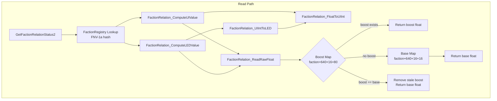
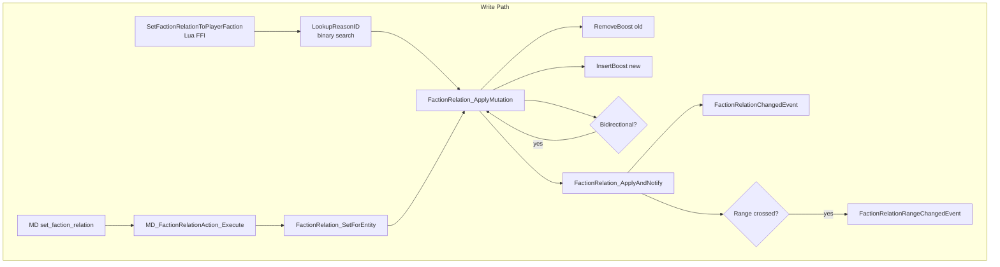

# Faction Relation System -- Binary Internals

> Deep reverse engineering of X4.exe v9.00 faction relation read/write paths.
> All addresses relative to imagebase `0x140000000`.
> NOTE: All code below is pseudocode

---

## 1. Overview

The faction relation system stores floating-point values in `[-1.0, +1.0]` between every pair of factions. A **base map** holds the default relation, and a **boost map** layers temporary or permanent adjustments on top. The UI displays an integer in `[-30, +30]` derived via logarithmic interpolation, and a simplified LED color index in `[-4, +4]`.

### System Architecture




---

## 2. Read Path

### 2.1 GetFactionRelationStatus2

**Address:** `0x140AB9160`
**Signature:** `RelationDetails GetFactionRelationStatus2(const char* factionid)`
**PE Export:** Yes (index in `x4_exports.txt`)

Returns a `RelationDetails` struct:

```c
typedef struct {
    int relationStatus;   // +0: enum 0-6
    int relationValue;    // +4: UI integer [-30, +30]
    int relationLEDValue; // +8: LED index [-4, +4]
    bool isBoostedValue;  // +12: always false (not populated)
} RelationDetails;
```

**Pseudocode:**

```c
RelationDetails GetFactionRelationStatus2(const char* factionid) {
    RelationDetails result = { -1, 0, -1, false };

    if (!factionid || !*factionid) {
        LogError("...null/empty...");
        return result;
    }

    // FNV-1a hash of faction string
    uint64_t hash = fnv1a(factionid);

    // Binary tree lookup in g_FactionRegistry
    FactionClass* faction = FactionRegistry_Find(g_FactionRegistry, hash);
    if (!faction) {
        LogError("faction '%s' not found", factionid);
        return result;
    }

    // Determine player faction context
    FactionClass* player_faction = GetPlayerFaction();

    // Determine relation status enum
    int status = 6;  // default: friend
    if (faction == g_PlayerFactionContext) {
        status = 5;  // member (same faction)
    } else if (IsSameAlliance(faction, player_faction)) {
        status = 0;  // ally
    } else if (CheckInRange(faction, player_faction, RANGE_DOCK /*7*/)) {
        status = 4;  // neutral/dock
    } else if (CheckInRange(faction, player_faction, RANGE_ENEMY /*4*/)) {
        status = 3;  // attack
    } else if (CheckInRange(faction, player_faction, RANGE_NEMESIS /*9*/)) {
        status = 2;  // kill
    } else {
        if (CheckInRange(faction, player_faction, RANGE_FRIEND /*3*/))
            status = 1;  // hostile (below friend but above kill)
        // else status = 6 (friend)
    }

    result.relationStatus  = status;
    result.relationValue   = ComputeUIValue(faction);
    result.relationLEDValue = ComputeLEDValue(faction);
    return result;
}
```

**Relation Status Enum:**

| Value | Name | Meaning | Range Check |
|-------|------|---------|-------------|
| 0 | ally | Same alliance | `IsSameAlliance()` |
| 1 | hostile | Hostile (below friend threshold) | `!CheckInRange(friend)` fallback |
| 2 | kill | Kill-on-sight | `CheckInRange(nemesis, 9)` |
| 3 | attack | Attackable | `CheckInRange(enemy, 4)` |
| 4 | neutral | Neutral/dock-friendly | `CheckInRange(dock, 7)` |
| 5 | member | Same faction as player | `faction == g_PlayerFactionContext` |
| 6 | friend | Friendly (default) | Default when none match |

### 2.2 FactionRelation_GetFloat

**Address:** `0x14030E6B0`
**Signature:** `double FactionRelation_GetFloat(FactionClass* a, FactionClass* b)`

```c
double FactionRelation_GetFloat(FactionClass* a, FactionClass* b) {
    if (a == b)
        return 1.0f;  // self-relation
    return FactionRelation_ReadRawFloat(*(a + 640) + 16, b);
}
```

**Key offset:** Each `FactionClass` has a pointer at **+640** to its `RelationData` structure. The relation maps begin at `RelationData + 16`.

### 2.3 FactionRelation_ReadRawFloat

**Address:** `0x1404353A0`
**Signature:** `float FactionRelation_ReadRawFloat(RelationDataBase* base, FactionClass* target)`

This is the core float reader. It implements a two-layer lookup:

```c
float FactionRelation_ReadRawFloat(RelationDataBase* base, FactionClass* target) {
    if (!target) return -2.0f;  // sentinel: no data

    // 1. Search boost map (base + 80, keyed by faction pointer)
    BoostNode* boost = boost_map_find(base + 80, target);
    if (boost) {
        float boost_val = boost->read_value();       // via vtable+40
        float base_val  = boost->read_base_value();   // via vtable+8
        if (fabs(boost_val - base_val) < 0.000001f) {
            // Boost equals base -- stale, remove it
            FactionRelation_RemoveBoost(base, target);
        } else if (boost_val != -2.0f) {
            return boost_val;
        }
    }

    // 2. Fall through to base map (base + 16, keyed by faction pointer)
    BaseNode* node = base_map_find(base + 16, target);
    if (!node) return 0.0f;  // no entry = neutral
    return node->value;       // at node + 40 (0x28)
}
```

**Data layout of RelationDataBase (at faction+640+16):**

| Offset | Type | Description |
|--------|------|-------------|
| +0 | - | Red-black tree header |
| +16 | RBTree | Base relation map (keyed by FactionClass*) |
| +80 | RBTree | Boost relation map (keyed by FactionClass*) |

**Base map node layout:** Key at `node+32`, float value at `node+40`.
**Boost map node layout:** Key at `node+32`, value via vtable virtual call.

### 2.4 FactionRelation_FloatToUIInt

**Address:** `0x14099C780`
**Signature:** `int FactionRelation_FloatToUIInt(FactionRegistry* reg, int unused)`

Converts the most recently read raw float to a UI integer in `[-30, +30]`. Uses a threshold tree stored in the `FactionRegistry` to define mapping breakpoints.

The conversion uses:
- **Logarithmic interpolation** for values where `|f| >= threshold` (approximately 0.0032)
- **Linear interpolation** for values near zero (`|f| < threshold`)
- **Epsilon rounding:** `+/- 0.00001` added before truncation to handle floating-point precision

### 2.5 FactionRelation_ComputeUIValue

**Address:** `0x140881870`
**Signature:** `int FactionRelation_ComputeUIValue(FactionClass* faction)`

Orchestrator for read path:

```c
int FactionRelation_ComputeUIValue(FactionClass* faction) {
    FactionClass* player = ResolvePlayerFaction();
    if (!faction || !player) return 0;

    if (player != faction) {
        // Reads raw float, stores in FactionRegistry internal state
        FactionRelation_ReadRawFloat(*(faction + 640) + 16, player);
    }
    // Convert cached float to UI int
    return FactionRelation_FloatToUIInt(g_FactionRegistry, 0);
}
```

### 2.6 FactionRelation_ComputeLEDValue

**Address:** `0x140881660`
**Signature:** `int FactionRelation_ComputeLEDValue(FactionClass* faction)`

Same read-then-convert pattern, but maps through `UIIntToLED`:

```c
int FactionRelation_ComputeLEDValue(FactionClass* faction) {
    FactionClass* player = ResolvePlayerFaction();
    if (!faction || !player) return 0;

    if (player != faction)
        FactionRelation_ReadRawFloat(*(player + 640) + 16, faction);

    return FactionRelation_UIIntToLED(g_FactionRegistry, 0);
}
```

### 2.7 FactionRelation_UIIntToLED

**Address:** `0x140881B80`
**Signature:** `int FactionRelation_UIIntToLED(int ui_int)`

Maps UI integer to LED color index:

| UI Value Range | LED Value | Color Meaning |
|----------------|-----------|---------------|
| <= -30 | -4 | Deep hostility |
| -29 to -20 | -3 | Strong enemy |
| -19 to -10 | -2 | Enemy |
| -9 to -1 | -1 | Unfriendly |
| 0 | 0 | Neutral |
| 1 to 9 | 1 | Friendly |
| 10 to 19 | 2 | Good friend |
| 20 to 29 | 3 | Strong ally |
| >= 30 | 4 | Deep alliance |

---

## 3. Write Path

### 3.1 SetFactionRelationToPlayerFaction

**Address:** `0x14017E950`
**Signature:** `void SetFactionRelationToPlayerFaction(const char* factionid, const char* reasonid, float boostvalue)`
**PE Export:** Yes | **Lua FFI:** Yes

This is the primary API for Lua/FFI callers.

```c
void SetFactionRelationToPlayerFaction(
    const char* factionid,
    const char* reasonid,
    float boostvalue    // passed via xmm2, additive boost
) {
    if (!factionid) { LogError("...nullptr"); return; }

    // FNV-1a lookup in FactionRegistry
    FactionClass* faction = FactionRegistry_Find(g_FactionRegistry, fnv1a(factionid));
    if (!faction) { LogError("...not found '%s'", factionid); return; }

    if (!reasonid) { LogError("...nullptr"); return; }

    // Binary search for reason string -> integer ID
    int reason_id = FactionRelation_LookupReasonID(0, string_view(reasonid));
    if (!reason_id) {
        LogError("Failed to retrieve reason with ID '%s'", reasonid);
        return;
    }

    // Apply the mutation (bidirectional = 1)
    FactionRelation_ApplyMutation(
        faction,
        g_PlayerFactionContext,
        boostvalue,            // xmm2
        reason_id,             // r9d
        /*bidirectional=*/ 1   // stack
    );
}
```

**Important:** The `boostvalue` is an **additive** float in `~[-1.0, +1.0]` range. The mutation is always bidirectional (faction->player AND player->faction).

### 3.2 FactionRelation_LookupReasonID

**Address:** `0x1402CAE60`
**Signature:** `int FactionRelation_LookupReasonID(void* unused, string_view* reason_str)`

Performs binary search in a sorted array at `0x143C9A530` (BSS, populated at startup by `FactionRelation_InitReasonTable`).

Each entry is 24 bytes: `{char* str_ptr, uint64_t str_len, int32_t reason_id}`.

Returns the integer reason ID, or `dword_143C9A840` (default = 0) if not found.

### 3.3 FactionRelation_ApplyMutation

**Address:** `0x1409940E0`
**Signature:** `void FactionRelation_ApplyMutation(FactionClass* from, FactionClass* to, float boost /*xmm2*/, int reason_id /*r9d*/, bool bidirectional /*stack*/)`

This is the **core mutation function**. All relation changes flow through it.

```c
void FactionRelation_ApplyMutation(
    FactionClass* from,
    FactionClass* to,
    float boost,           // xmm2: the new absolute boost value
    int reason_id,         // r9d
    bool bidirectional     // stack byte
) {
    // Guard checks
    if (!to || to == from) return;
    if (*(*(from + 640) + 746))  return;  // from is relation-locked
    if (*(*(to   + 640) + 746))  return;  // to is relation-locked

    // Read old relation float
    float old_float = FactionRelation_GetFloat(from, to);

    // Get relation data pointer
    RelationData* rd = *(from + 640);

    // Get current timestamp from TLS
    uint64_t timestamp = get_tls_timestamp();

    // Remove old boost, insert new one
    FactionRelation_InsertBoost(
        rd + 16,          // relation data base
        from, to,         // source/target
        0, 0,             // clear old value
        timestamp
    );

    // If bidirectional, recurse for reverse direction (with bidirectional=false)
    if (bidirectional)
        FactionRelation_ApplyMutation(to, from, boost, reason_id, false);

    // Notify subsystems
    FactionRelation_ApplyAndNotify(from, to, old_float, new_float, reason_id);

    // Read new float to check if it actually changed
    float new_float = FactionRelation_GetFloat(from, to);

    // If changed beyond epsilon, fire game events
    if (fabs(old_float - new_float) >= 0.000001f) {
        // Allocate and dispatch FactionRelationChangedEvent (0x38 bytes)
        // Fields: old_float, new_float, from_faction, to_faction, reason_id
        auto* evt = new FactionRelationChangedEvent();
        evt->old_value  = old_float;
        evt->new_value  = new_float;
        evt->faction_a  = from;
        evt->faction_b  = to;
        evt->reason     = reason_id;
        EventDispatch_PriorityQueue(game_event_queue, evt, timestamp, 1);

        // Check if relation crossed a range boundary
        if (FactionRelation_CheckRangeChanged(g_FactionRegistry)) {
            auto* rev = new FactionRelationRangeChangedEvent();
            rev->faction_a = from;
            rev->faction_b = to;
            EventDispatch_PriorityQueue(game_event_queue, rev, timestamp, 1);
        }
    }
}
```

**Key observations:**
- **Relation-locked flag** at `*(faction+640)+746` -- if set, no mutations are allowed
- **Bidirectional recursion** -- when `bidirectional=true`, calls itself with reversed factions and `bidirectional=false` to prevent infinite recursion
- **Two event types fired:** `FactionRelationChangedEvent` (always) and `FactionRelationRangeChangedEvent` (only on range boundary crossing)

### 3.4 FactionRelation_InsertBoost

**Address:** `0x140A07A50`
**Signature:** `void FactionRelation_InsertBoost(RelationDataBase* base, FactionClass* source, FactionClass* target, float value, int param, uint64_t timestamp)`

Creates a `RelationBoostSource<FactionClass*, FactionClass*, float>` object (40 bytes):

| Offset | Type | Field |
|--------|------|-------|
| +0 | void* | vtable (RelationBoostSource) |
| +8 | FactionClass* | source faction |
| +16 | float | boost value |
| +20 | int | parameter |
| +24 | uint64_t | timestamp |
| +32 | FactionClass* | target faction |

Always calls `FactionRelation_RemoveBoost` first to clear any existing boost for the same target.

### 3.5 Other Write Entry Points

| Function | Address | Description |
|----------|---------|-------------|
| `FactionRelation_SetForEntity` | `0x1409943B0` | Wrapper: reads float then calls `ApplyMutation(bidirectional=1)` |
| `MD_FactionRelationAction_Execute` | `0x140B92BF0` | MD script action handler for `set_faction_relation` / `add_faction_relation` |
| `FactionRelation_ApplyAndNotify` | `0x140993DC0` | Fires `RelationChangedEvent` + `RelationRangeChangedEvent` for player faction only |

---

## 4. Conversion Formulas

### 4.1 Float to UI Integer

The internal float `[-1.0, +1.0]` maps to UI integer `[-30, +30]` using a **threshold tree** stored in `g_FactionRegistry`.

The general formula uses logarithmic interpolation:

```
For |f| >= threshold:
    ui = lower_ui + (upper_ui - lower_ui) * log(f / lower_f) / log(upper_f / lower_f)

For |f| < threshold (near zero):
    ui = linear_interpolation(lower_ui, upper_ui, f, lower_f, upper_f)
```

**Known thresholds** (from game MD scripts):
- `-0.0032` maps to UI `-5` (boundary of "neutral" range)
- `+0.0032` maps to UI `+5`
- Each `0.0064` of positive change in the neutral range corresponds to UI +10

The threshold of `0.0032` is where the system switches between log and linear interpolation. Epsilon `1e-5` is added/subtracted before casting to int for rounding stability.

### 4.2 Approximate Inverse (UI Integer to Float)

The inverse of the float-to-UI conversion can be approximated:

```
Log region (|ui| >= 5):  float = sign * 10^(|ui|/10) / 1000
Linear region (|ui| < 5): float = sign * |ui| * 0.00064
```

Using the midpoint of each bucket (`|ui| + 0.5`) avoids threshold rounding errors when the game truncates via `cvttss2si`.

### 4.3 UI Integer to LED

```c
int UIIntToLED(int ui) {
    if (ui <= -30) return -4;
    if (ui <= -20) return -3;
    if (ui <= -10) return -2;
    if (ui <    0) return -1;
    if (ui ==   0) return  0;
    if (ui <   10) return  1;
    if (ui <   20) return  2;
    if (ui <   30) return  3;
    return  4;
}
```

### 4.4 Approximate Float-to-UI Reference Table

| Float Range | UI Range | LED | Relation |
|-------------|----------|-----|----------|
| -1.0 to -0.8 | -30 to -25 | -4 | Kill |
| -0.8 to -0.3 | -25 to -15 | -3/-2 | Enemy |
| -0.3 to -0.0032 | -15 to -5 | -2/-1 | Hostile |
| -0.0032 to +0.0032 | -5 to +5 | -1/0/+1 | Neutral |
| +0.0032 to +0.3 | +5 to +15 | +1/+2 | Friendly |
| +0.3 to +0.8 | +15 to +25 | +2/+3 | Friend |
| +0.8 to +1.0 | +25 to +30 | +3/+4 | Ally |

> Note: Exact breakpoints depend on the threshold tree loaded from game data at runtime.
> The values above are approximate based on MD script comments and interpolation analysis.

---

## 5. Struct Layouts

### 5.1 FactionClass (partial)

| Offset | Type | Description |
|--------|------|-------------|
| +0 | void* | vtable |
| +560 | int | faction_index (used in notification hashing) |
| +640 | RelationData* | Pointer to faction's relation data structure |

### 5.2 RelationData (at *faction+640)

| Offset | Type | Description |
|--------|------|-------------|
| +0 | ... | Internal header |
| +16 | RelationDataBase | Start of relation maps |
| +746 | bool | relation_locked flag (prevents all mutations) |

### 5.3 RelationDataBase (at RelationData+16)

| Offset | Type | Description |
|--------|------|-------------|
| +0 | RBTree header | ... |
| +16 | RBTree | Base relation map (permanent values) |
| +80 | RBTree | Boost relation map (temporary/additive overrides) |

### 5.4 Base Map Node

| Offset | Type | Description |
|--------|------|-------------|
| +0 | void* | parent pointer |
| +8 | void* | left child |
| +16 | void* | right child |
| +28 | int | range enum (for range tree) |
| +32 | FactionClass* | key (target faction) |
| +36 | float | min threshold |
| +40 | float | base relation value |

### 5.5 FactionRelationChangedEvent (0x38 bytes)

| Offset | Type | Description |
|--------|------|-------------|
| +0 | void* | vtable (`FactionRelationChangedEvent`) |
| +8 | int | flags (0) |
| +16 | void* | reserved (0) |
| +24 | FactionClass* | faction_a (initiator) |
| +32 | FactionClass* | faction_b (target) |
| +40 | float | old_value |
| +44 | float | new_value |
| +48 | int | reason_id |

### 5.6 FactionRelationRangeChangedEvent (0x28 bytes)

| Offset | Type | Description |
|--------|------|-------------|
| +0 | void* | vtable (`FactionRelationRangeChangedEvent`) |
| +8 | int | flags (0) |
| +16 | void* | reserved (0) |
| +24 | FactionClass* | faction_a |
| +32 | FactionClass* | faction_b |

### 5.7 RelationBoostSource (0x28 bytes)

| Offset | Type | Description |
|--------|------|-------------|
| +0 | void* | vtable |
| +8 | FactionClass* | source faction |
| +16 | float | boost value |
| +20 | int | parameter |
| +24 | uint64_t | timestamp |
| +32 | FactionClass* | target faction |

---

## 6. Reason ID System

### 6.1 Initialization

`FactionRelation_InitReasonTable` at `0x1409FE7D0` populates three parallel BSS tables from a static source array at `0x142538310`.

| BSS Address | Contents |
|-------------|----------|
| `0x143C9A3A8` | Unsorted reason entries (16 entries, 24 bytes each) |
| `0x143C9A530` | Sorted reason entries (for binary search by `LookupReasonID`) |
| `0x143C9A6B8` | Third copy (purpose: reverse lookup or display) |
| `0x143C9A6B0` | Count of entries in sorted table |
| `0x143C9A840` | Default reason ID for "not found" (= 0) |

### 6.2 Valid Reason Strings

The source table at `0x142538310` contains 16 entries in two groups of 8. Each entry is `{char* string, int32_t id}`:

| ID | String | Description |
|----|--------|-------------|
| 0 | *(empty)* | Default / unspecified |
| 1 | `missioncompleted` | Mission completed successfully |
| 2 | `destroyedfactionenemy` | Destroyed an enemy of the faction |
| 3 | `smalltalkreward` | Smalltalk / conversation reward |
| 4 | `attackedobject` | Attacked a faction's object |
| 5 | `boardedobject` | Boarded a faction's object |
| 6 | `killedobject` | Killed/destroyed a faction's object |
| 7 | `hackingdiscovered` | Hacking was discovered |
| 8 | `scanningdiscovered` | Illegal scanning was discovered |
| 9 | `illegalcargo` | Caught with illegal cargo |
| 10 | `missionfailed` | Mission failed |
| 11 | `ownerchanged` | Object ownership changed |
| 12 | `tradecompleted` | Trade completed successfully |
| 13 | `illegalplot` | Illegal plot action |
| 14 | `markedashostile` | Manually marked as hostile |
| 15 | `wardeclaration` | War declaration |
| 16 | *(empty -- second group start)* | Group 2 separator |

**Second group** (IDs 0-2, different table):

| ID | String | Description |
|----|--------|-------------|
| 0 | `sectortravel` | Sector travel activity |
| 1 | `sectoractivity` | Sector activity tracking |
| 2 | `objectactivity` | Object interaction activity |

### 6.3 MD-Accessible Reason Strings

The `common.xsd` schema defines the subset available to Mission Director scripts via `relationchangereasonlookup`:

```
missioncompleted, destroyedfactionenemy, smalltalkreward,
attackedobject, boardedobject, killedobject,
hackingdiscovered, scanningdiscovered, illegalcargo,
missionfailed, tradecompleted, illegalplot
```

Note: `ownerchanged`, `markedashostile`, and `wardeclaration` are NOT in the MD schema -- they are engine-internal-only reasons. The second group (`sectortravel`, `sectoractivity`, `objectactivity`) is also engine-internal.

### 6.4 Lookup Mechanics

`FactionRelation_LookupReasonID` uses standard binary search (`memcmp`-based) on the sorted table. The input is a `string_view` (pointer + length). Returns 0 on failure, which is the empty/default reason.

---

## 7. Faction Discovery System

Three independent "known" concepts control faction visibility:

| Concept | API | Effect |
|---------|-----|--------|
| `set_faction_known` (MD) | `<set_faction_known faction="..." known="true"/>` | Sets `IsFactionKnown()` flag |
| `AddKnownItem` (Lua) | `AddKnownItem("factions", faction_id)` | Adds to `GetLibrary("factions")`, drives diplomacy UI |
| `IsKnownItemRead` (C FFI) | `C.IsKnownItemRead("factions", id)` | Checks if player has READ the encyclopedia entry |

`GetLibrary("factions")` returns only factions added via `AddKnownItem` -- NOT all factions in the game. `IsFactionKnown()` tracks a separate flag set by MD `set_faction_known`. Both must be called for a faction to appear correctly in the diplomacy tab.

---

## 8. Global Variables

| Address | Name | Type | Description |
|---------|------|------|-------------|
| `0x146C73F80` | `g_FactionRegistry` | FactionRegistry* | Master faction registry (hash map + threshold trees) |
| `0x1438776C8` | `g_PlayerFactionContext` | FactionClass* | Current player's faction object |
| `0x143C9FA58` | `g_GameUniverse` | GameUniverse* | Game universe root (event queues at +552, +560) |
| `0x143C9A530` | *(unnamed)* | ReasonEntry[16] | Sorted reason lookup table (BSS) |
| `0x143C9A6B0` | *(unnamed)* | int64_t | Reason table entry count |
| `0x143C9A840` | *(unnamed)* | int32_t | Default reason ID (0) |

---

## 9. FNV-1a Hash (Faction String Lookup)

The faction registry uses FNV-1a to hash faction ID strings:

```c
uint64_t fnv1a(const char* str) {
    uint64_t hash = 2166136261;      // 0x811C9DC5
    size_t len = strlen(str);
    for (size_t i = 0; i < len; i++) {
        hash = (uint64_t)str[i] ^ (16777619 * hash);  // 0x01000193
    }
    return hash;
}
```

The registry at `g_FactionRegistry + 16` is a red-black tree keyed by this hash. Node layout: key at `node + 32`, faction data pointer at `node + 48`.

---

## 10. Address Table

| Address | Name | Size | Description |
|---------|------|------|-------------|
| `0x140AB9160` | `GetFactionRelationStatus2` | 0x21F | Read faction-player relation status |
| `0x14017E950` | `SetFactionRelationToPlayerFaction` | 0x180 | Write faction-player relation (Lua FFI) |
| `0x14099C780` | `FactionRelation_FloatToUIInt` | 0x1C4 | Float [-1,+1] to UI int [-30,+30] |
| `0x14030E6B0` | `FactionRelation_GetFloat` | 0x3C | Read float between two factions |
| `0x1409940E0` | `FactionRelation_ApplyMutation` | 0x2CE | Core mutation (boost insert + events) |
| `0x1404353A0` | `FactionRelation_ReadRawFloat` | 0x113 | Two-layer float read (boost/base maps) |
| `0x1402CAE60` | `FactionRelation_LookupReasonID` | 0x160 | Binary search reason string -> int |
| `0x140881870` | `FactionRelation_ComputeUIValue` | 0xEE | Orchestrate: read float -> UI int |
| `0x140881660` | `FactionRelation_ComputeLEDValue` | 0xD9 | Orchestrate: read float -> LED value |
| `0x140881B80` | `FactionRelation_UIIntToLED` | 0x83 | UI int -> LED color index [-4,+4] |
| `0x140994620` | `FactionRelation_CheckInRange` | 0x68 | Check if relation is in named range |
| `0x1409977A0` | `FactionRelation_IsSameAlliance` | 0x42 | Check alliance membership |
| `0x14099C160` | `FactionRelation_CheckRangeChanged` | 0x148 | Detect range boundary crossing |
| `0x140A07A50` | `FactionRelation_InsertBoost` | 0xC2 | Insert boost into boost map |
| `0x1404277B0` | `FactionRelation_RemoveBoost` | 0xF8 | Remove boost from boost map |
| `0x140993DC0` | `FactionRelation_ApplyAndNotify` | 0x320 | Fire change events for player faction |
| `0x1409FE7D0` | `FactionRelation_InitReasonTable` | 0x6EB | Initialize reason string lookup table |
| `0x1409943B0` | `FactionRelation_SetForEntity` | 0x6F | Entity-level relation setter |
| `0x140B92BF0` | `MD_FactionRelationAction_Execute` | 0x1BA | MD script action handler |
| `0x141483170` | `FactionRelation_LogInterpolate` | 0x97 | Log interpolation for float->UI |
| `0x1414830A0` | `FactionRelation_LinearInterpolate` | 0x58 | Linear interpolation for float->UI |
| `0x1409B0D20` | `FactionRelation_ResolveTarget` | - | Resolve target faction for status check |

### Global Variables

| Address | Name | Description |
|---------|------|-------------|
| `0x146C73F80` | `g_FactionRegistry` | Master faction registry |
| `0x1438776C8` | `g_PlayerFactionContext` | Player's faction object |
| `0x143C9FA58` | `g_GameUniverse` | Game universe root |
| `0x143C9A530` | Reason table (sorted) | Binary-search reason entries |
| `0x143C9A6B0` | Reason table count | Number of entries |
| `0x143C9A840` | Default reason ID | Value 0 |
