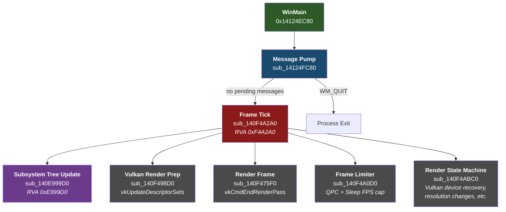
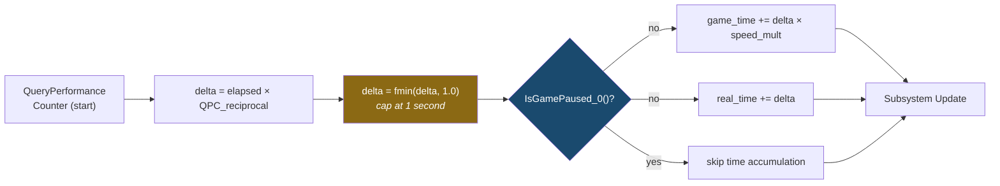
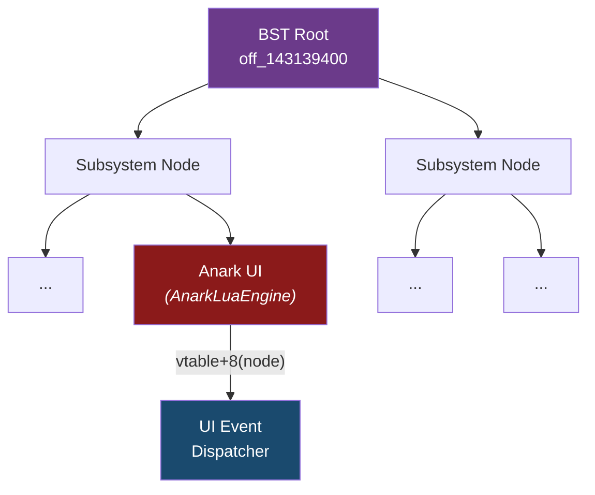
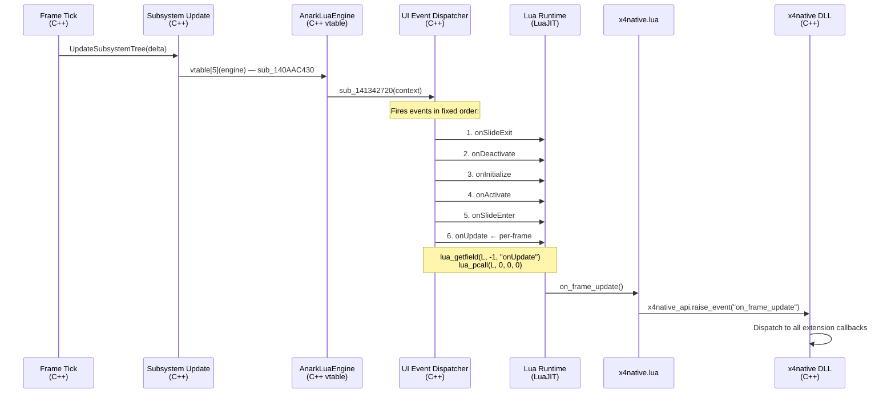
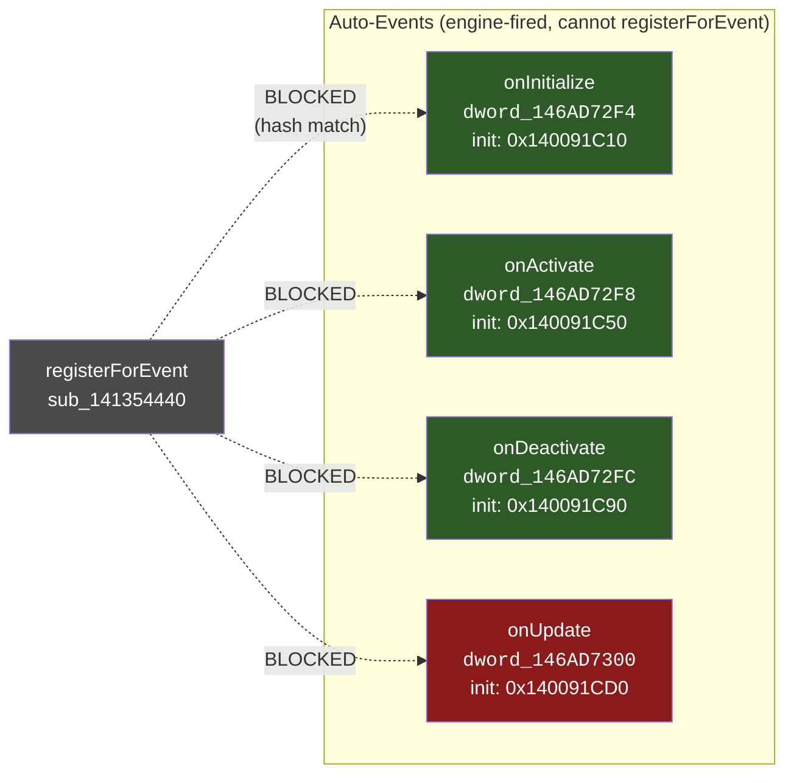
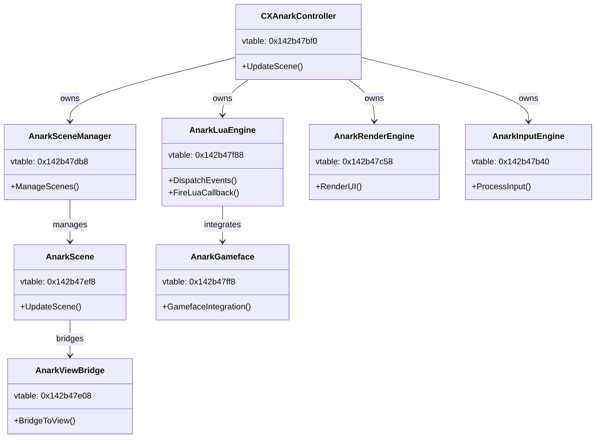

# X4 Game Loop — Reverse Engineering Notes

> **Binary:** X4.exe v9.00 (build 900) · **Date:** 2026-03
>
> All addresses are absolute (imagebase `0x140000000`). Subtract imagebase to get RVA.

---

## 1. High-Level Architecture



---

## 2. Message Pump (sub\_14124FC80)

Standard Win32 message loop with game-specific additions:

```c
// Pseudocode — reconstructed from Hex-Rays
while (Msg.message != WM_QUIT) {
    if (PeekMessageW(&Msg, NULL, 0, 0, PM_REMOVE)) {
        // Handle power notifications, hotkeys
        TranslateMessage(&Msg);
        DispatchMessageW(&Msg);
    } else {
        // No messages — run a frame
        FrameTick(qword_146C6B9C8, isSuspended);
    }
}
```

**Key detail:** When the game is *suspended* (e.g. minimized, lost focus), `isSuspended = true` is passed to the frame tick, which skips simulation and only runs the render pipeline (keeps Vulkan alive).

---

## 3. Frame Tick (sub\_140F4A2A0) — The Core Per-Frame Function

This is the most important function in the binary for modding purposes. Called once per frame from the message pump.

### Signature (reconstructed)

```c
void __fastcall FrameTick(EngineContext* ctx, bool isSuspended);
// ctx = global qword_146C6B9C8
```

### Timing Logic



### Frame Tick Branches

| Condition | Path | What Happens |
|-----------|------|--------------|
| `isSuspended == false` | **Normal frame** | Calculate delta → accumulate game time → update subsystems → render → limit FPS |
| `isSuspended == true` | **Suspended frame** | Iterate 17 subsystems via vtable calls (keep-alive) → render → limit FPS |

### Pseudocode (normal frame path)

```c
void FrameTick(EngineContext* ctx, bool isSuspended) {
    QueryPerformanceCounter(&now);
    double elapsed = (now - last_qpc) * qpc_reciprocal;  // seconds
    last_qpc = now;
    double delta = fmin(elapsed, 1.0);  // hard cap

    if (!isSuspended) {
        if (!IsGamePaused_0()) {
            // xmmword_146ADB5E8 += delta * qword_146ADB610
            game_time += delta * speed_multiplier;
            // xmmword_146ADB5F8 += delta
            real_time += delta;
        }
        UpdateSubsystemTree(delta);  // sub_140E999D0
    } else {
        // Iterate 17 subsystems for keep-alive (vtable calls)
    }

    VulkanRenderPrep();    // sub_140F498D0
    RenderFrame(ctx, ...); // sub_140F475F0
    FrameLimiter(ctx);     // sub_140F4A0D0
    RenderStateMachine();  // sub_140F4ABC0  (device lost, resolution, etc.)
}
```

---

## 4. Subsystem Tree Update (sub\_140E999D0)

Iterates a **binary search tree** of subsystem objects, calling each one's virtual update method.



### Threading Model

```c
if (is_main_thread()) {        // TLS + 0x788 check
    iterate_bst_directly();    // Inline BST walk, call vtable+8
} else {
    EnterCriticalSection(&cs);
    // Signal main thread, WaitForSingleObject
    LeaveCriticalSection(&cs);
}
```

The BST is rooted at two globals:
- `off_143139400` — tree root pointer
- `off_1431393E0` — sentinel / end node

Each node's update is dispatched via `node->vtable[1](node)` (offset +8 in the vtable).

---

## 5. UI Event Dispatch — onUpdate to on\_frame\_update

This is the chain that delivers per-frame ticks to x4native extensions.



### UI Event Dispatcher (sub\_141342720) — Internals

The dispatcher calls `sub_141344A70` for each event name, which does:

```c
void FireLuaEvent(lua_State* L, const char* eventName) {
    lua_getfield(L, -1, eventName);  // Get handler from widget table
    if (lua_isfunction(L, -1)) {
        lua_pcall(L, 0, 0, 0);      // Call with no args
    } else {
        lua_pop(L, 1);              // Not a function, clean up stack
    }
}
```

---

## 6. Auto-Event Protection System

Four UI events are "auto-events" — fired automatically by the engine and **blocked from manual registration** via `registerForEvent`.

### Hash Algorithm

```c
// Used for event name lookup (max 100 chars)
uint32_t hash_event_name(const char* name) {
    uint32_t hash = 0;
    for (int i = 0; i < 100 && name[i]; i++) {
        hash = (name[i] + 65599 * hash) & 0x7FFFFFFF;
    }
    return hash;
}
```

### Protected Events



The `registerForEvent` implementation (sub\_141354440) computes the hash of the requested event name and compares it against these four stored hashes. If matched, registration is silently rejected.

**String table** at `0x142911918`:

| Address | String |
|---------|--------|
| `0x142911918` | `onActivate` |
| `0x142911924` | `onDeactivate` |
| `0x142911931` | `element` |
| `0x142911939` | `self` |
| `0x14291193E` | `onUpdate` |
| `0x142911947` | `onSlideExit` |
| `0x142911953` | `onSlideEnter` |

---

## 7. Frame Limiter (sub\_140F4A0D0)

Uses QPC-based timing with exponential moving average smoothing:

```c
void FrameLimiter(EngineContext* ctx) {
    QueryPerformanceCounter(&now);
    double frame_time = (now - last_frame_qpc) * qpc_reciprocal;

    // EMA smoothing: 90% old, 10% new
    smoothed_frame_time = 0.9 * smoothed_frame_time + 0.1 * frame_time;

    double target = 1.0 / target_fps;
    if (frame_time < target) {
        Sleep((DWORD)((target - frame_time) * 1000.0));
    }

    last_frame_qpc = now;
}
```

---

## 8. Render State Machine (sub\_140F4ABC0)

A large flag-driven state machine controlled by `dword_146A59B40`. Handles:

| Flag | Purpose |
|------|---------|
| `0x40000` | **Lost device recovery** — Vulkan device lost, re-init pipeline. Timeout at 30s. |
| `0x20000` | **Resolution change** — Recreate swapchain and framebuffers |
| `0x400` | **Viewport reset** — Snap viewport to new size |
| `0x800` | **Display option toggle** |
| `0x1000` | **Anti-aliasing change** |
| `0x2000` | **Shader recompile** |
| `0x4000` | **Texture quality change** |
| `0x200` | **Swapchain format change** |
| `0x4` | **Swapchain rebuild** |
| `0x80` | **Asset reload** |
| `0x800000` | **Full scene reload** — Destroys and recreates all render objects |
| `0x8000` | **Pipeline cache rebuild** |
| `0x100` | **UI texture reload** |
| `0x8` | **GPU memory defrag** |
| `0x400000` | **Debug overlay toggle** |
| `0x40` | **Window mode change** |
| `0x1` | **Generic dirty flag** |
| `0x2` | **Buffer resize** |

---

## 9. RTTI — UI Class Hierarchy

Recovered RTTI names from the `UI::XAnark` namespace:



---

## 10. Key Globals

| Address | Type | Name | Description |
|---------|------|------|-------------|
| `0x146C6B9C8` | `void*` | Engine Context | Main engine/app object, passed as `a1` to frame tick |
| `0x146C6BD40` | `void*` | Frame Sync Context | SL helper / critical section for frame sync |
| `0x146ADB5E8` | `double[2]` | Game Time | Accumulated game time (`+= delta × speed_multiplier`) |
| `0x146ADB5F8` | `double[2]` | Real Time | Accumulated real time (only when not paused) |
| `0x146ADB610` | `double` | Speed Multiplier | Game speed (1×, 2×, 5×, 10×) |
| `0x14313B078` | `double` | QPC Reciprocal | `1.0 / QueryPerformanceFrequency` — seconds per tick |
| `0x146ADB5C0` | `CRITICAL_SECTION` | Time Lock | Guards game/real time accumulation |
| `0x146A59B40` | `uint32_t` | Render Flags | Render state machine (see §8) |
| `0x143139400` | `void*` | Subsystem BST Root | Root of the subsystem update tree |
| `0x1431393E0` | `void*` | Subsystem BST Sentinel | End/sentinel node |
| `0x146AD72F4` | `uint32_t[4]` | Auto-Event Hashes | Hash values for the 4 protected events |

---

## 11. Function Address Table

Quick reference for all identified functions.

| Name (proposed) | Address | RVA | Size | Purpose |
|-----------------|---------|-----|------|---------|
| `WinMain` | `0x14124EC80` | `0x124EC80` | ~0x6AA | Entry point |
| `X4_MessagePump` | `0x14124FC80` | `0x124FC80` | — | Win32 message loop |
| `X4_FrameTick` | `0x140F4A2A0` | `0xF4A2A0` | — | Core per-frame function |
| `X4_UpdateSubsystems` | `0x140E999D0` | `0xE999D0` | — | BST iteration, calls vtable+8 |
| `X4_VulkanRenderPrep` | `0x140F498D0` | `0xF498D0` | — | vkUpdateDescriptorSets |
| `X4_RenderFrame` | `0x140F475F0` | `0xF475F0` | — | vkCmdEndRenderPass, descriptors |
| `X4_FrameLimiter` | `0x140F4A0D0` | `0xF4A0D0` | — | QPC EMA + Sleep FPS cap |
| `X4_RenderStateMachine` | `0x140F4ABC0` | `0xF4ABC0` | — | Flag-driven render reconfiguration |
| `Anark_DispatchEvents` | `0x140AAC430` | `0xAAC430` | — | AnarkLuaEngine vtable[5] |
| `Anark_UIEventDispatcher` | `0x141342720` | `0x1342720` | — | Fires onUpdate etc. to Lua |
| `Anark_FireLuaCallback` | `0x141344A70` | `0x1344A70` | — | lua_getfield + lua_pcall |
| `Anark_RegisterForEvent` | `0x141354440` | `0x1354440` | — | Event registration (blocks auto-events) |
| `IsGamePaused_0` | `0x14145A020` | `0x145A020` | — | Returns pause state |
| `HashInit_onInitialize` | `0x140091C10` | `0x91C10` | — | Computes and stores hash |
| `HashInit_onActivate` | `0x140091C50` | `0x91C50` | — | Computes and stores hash |
| `HashInit_onDeactivate` | `0x140091C90` | `0x91C90` | — | Computes and stores hash |
| `HashInit_onUpdate` | `0x140091CD0` | `0x91CD0` | — | Computes and stores hash |

---

## 12. Hookable Internal Function Candidates

For x4native's internal function hooking system (MinHook on non-exported functions resolved by RVA):

| Candidate | RVA | Why Hook It | Risk |
|-----------|-----|-------------|------|
| **X4_FrameTick** | `0xF4A2A0` | Pre/post frame callbacks with engine context. Most general-purpose hook point. | Low — simple signature, called from one site |
| **X4_UpdateSubsystems** | `0xE999D0` | Sim-only updates (skipped when suspended). Good for game logic. | Medium — BST iteration, threading concerns |
| **X4_FrameLimiter** | `0xF4A0D0` | Post-render timing data. Useful for frame time monitoring. | Low — leaf function |
| **IsGamePaused_0** | `0x145A020` | Intercept/override pause state. | Low — simple boolean return |

> **Note:** RVAs are version-specific (v9.00 build 900). A future version database will track RVA changes across game patches.

---

## 13. Engine Context Structure (qword\_146C6B9C8)

The engine context is a **736-byte plain struct** (no vtable) passed as the first argument to `FrameTick`. It contains render state, synchronization primitives, and frame counters.

| Offset | Type | Field | Notes |
|--------|------|-------|-------|
| `+0` | — | — | No vtable pointer (plain struct) |
| `+584` | `int` | Frame Counter | Monotonic per-frame counter |
| `+600` | `float` | FPS | Current frames per second |
| various | `CRITICAL_SECTION` | Sync primitives | Multiple CriticalSections for thread safety |
| various | — | Render state | Vulkan pipeline / swapchain state |

Total size: ~736 bytes. Allocated once at engine startup, never freed during game lifetime.

---

## 14. Related Documents

| Document | Contents |
|----------|----------|
| [THREADING.md](THREADING.md) | Complete thread map, main-thread-only proof, threading model |
| [STATE_MUTATION.md](STATE_MUTATION.md) | Safety analysis for calling exported functions from hooks |
| [SUBSYSTEMS.md](SUBSYSTEMS.md) | BST subsystem architecture, RTTI namespace map, event system |
