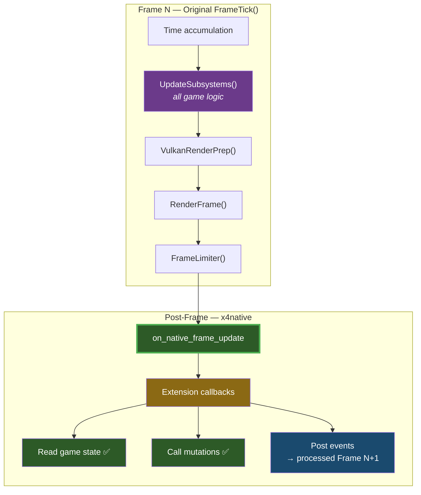
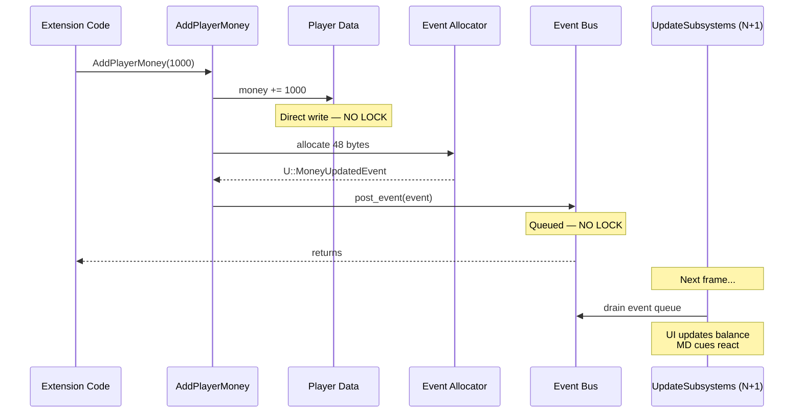
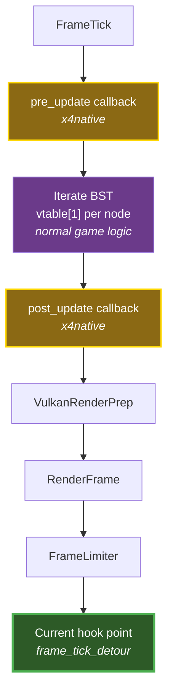

# X4 State Mutation Safety — Reverse Engineering Notes

> **Binary:** X4.exe v9.00 (build 900) · **Date:** 2026-03
>
> All addresses are absolute (imagebase `0x140000000`). Subtract imagebase to get RVA.

---

## 1. Summary

Exported game API functions are **safe to call from our frame tick hook**. They use no locking, assume main-thread context (which our hook provides), and either modify state directly or post events to the engine's event bus for next-frame processing.

---

## 2. Calling Context

Our `frame_tick_detour` wraps the original `FrameTick` call. After the original returns:

- All subsystems have completed their frame update
- All events for this frame have been dispatched
- Rendering is complete
- Game state is fully consistent and quiescent



---

## 3. Decompiled Function Analysis

### AddPlayerMoney — Direct State Mutation



**Exported wrapper:** `AddPlayerMoney` at `0x14013D5E0` (RVA `0x13D5E0`)

```c
// Thin wrapper — validates amount, delegates to inner function
void __fastcall AddPlayerMoney(__int64 amount) {
    if (amount)
        sub_140994350(qword_146C6B940, amount);  // inner implementation
}
```

**Inner implementation:** `sub_140994350` (RVA `0x994350`)

```c
void __fastcall AddPlayerMoney_Inner(ComponentSystem* sys, __int64 amount) {
    // 1. Direct state modification — NO LOCKING
    *(int64*)(player_data + offset) += amount;

    // 2. Allocate event (48 bytes, stack-like allocator)
    void* event = allocate_event(48);

    // 3. Set vtable → U::MoneyUpdatedEvent
    *(void**)event = &U_MoneyUpdatedEvent_vtable;

    // 4. Fill event payload
    event->player_id = get_player_id();
    event->old_amount = old;
    event->new_amount = old + amount;

    // 5. Post to event bus (sub_140953650)
    post_event(event_bus, event);
}
```

**Key observations:**
- **No CriticalSection, no mutex, no atomic operations** — pure sequential code
- Modifies player money directly in memory
- Creates a `U::MoneyUpdatedEvent` and posts it to the event bus
- The event will be processed in the next frame's `UpdateSubsystems` pass
- **Safe from our hook:** Yes — main thread, post-frame timing

### CreateOrder3 — Entity + Order Creation

**Exported wrapper:** `CreateOrder3` at `0x1401B9060` (RVA `0x1B9060`)

```c
// Creates an order for a controllable entity
int __fastcall CreateOrder3(uint64_t controllable, const char* orderid, bool instant) {
    // 1. Look up entity via component system (qword_146C6B940)
    void* entity = lookup_component(controllable);
    if (!entity) return 0;

    // 2. Validate player ownership
    if (!is_player_owned(entity)) return 0;

    // 3. Create order object — NO LOCKING
    void* order = sub_140423EA0(entity, orderid, instant);

    // 4. Returns 1-based order index
    return get_order_index(order);
}
```

**Key observations:**
- Component lookup via global `qword_146C6B940` — no synchronization
- Direct entity manipulation
- Order created inline, no deferred processing
- **Safe from our hook:** Yes — but the order won't be executed until next frame's AI update

---

## 4. Event Bus Architecture

### Event Posting (sub\_140953650)

All state mutations that need to notify other systems use the event bus:

```c
void post_event(EventBus* bus, Event* event) {
    // Append to event queue — NO LOCKING
    bus->queue[bus->count++] = event;
}
```

Events are typed C++ objects with vtables. Known event types from RTTI:

| Event Class | Namespace | Trigger |
|-------------|-----------|---------|
| `MoneyUpdatedEvent` | `U::` | `AddPlayerMoney` |
| `UpdateTradeOffersEvent` | `U::` | Trade system changes |
| `UpdateBuildEvent` | `U::` | Construction updates |
| `UpdateZoneEvent` | `U::` | Zone state changes |
| `UnitDestroyedEvent` | `U::` | Entity destruction |
| `UniverseGeneratedEvent` | `U::` | Universe creation |

### Event Timing

Events posted from our hook follow this lifecycle:

```mermaid
sequenceDiagram
    participant EXT as Extension (post-frame)
    participant MEM as Game Memory
    participant BUS as Event Bus
    participant SU as UpdateSubsystems
    participant UI as UI / MD / AI

    rect rgb(45, 90, 39)
    Note over EXT,BUS: Frame N (post-frame)
    EXT->>MEM: AddPlayerMoney(1000)
    Note over MEM: money modified immediately
    EXT->>BUS: U::MoneyUpdatedEvent queued
    end

    rect rgb(30, 74, 110)
    Note over SU,UI: Frame N+1
    SU->>BUS: drain event queue
    BUS->>UI: MoneyUpdatedEvent dispatched
    Note over UI: UI shows new balance<br/>MD cues react<br/>Other subsystems notified
    end
```



The 1-frame delay for event processing is invisible to the player and matches the engine's own event timing model.

---

## 5. Safety Classification

```mermaid
graph TD
    subgraph "Tier 1 — Safe: Property Mutations"
        T1A["AddPlayerMoney"] 
        T1B["SetPlayerName"]
        T1C["Property setters"]
    end

    subgraph "Tier 2 — Safe: Entity Operations"
        T2A["CreateOrder3"]
        T2B["Order manipulation"]
    end

    subgraph "Tier 3 — Safe: Read-Only Queries"
        T3A["GetPlayerName"]
        T3B["GetComponentName"]
        T3C["IsGamePaused"]
    end

    subgraph "Tier 4 — Caution: Complex Changes"
        T4A["Entity spawning"]
        T4B["Trade execution"]
        T4C["Sector/zone changes"]
    end

    T1A --> |"direct write\n+ event"| SAFE["✅ Safe from hook"]
    T2A --> |"inline creation\nexecutes next frame"| SAFE
    T3A --> |"zero side effects"| SAFE
    T4A --> |"may need subsystem\ncontext"| CAUTION["⚠️ Test case by case"]

    style SAFE fill:#2d5a27,color:#fff
    style CAUTION fill:#8b6914,color:#fff
    style T1A fill:#2d5a27,color:#fff
    style T2A fill:#1a4a6e,color:#fff
    style T3A fill:#4a4a4a,color:#fff
    style T4A fill:#8b1a1a,color:#fff
```



### Tier 1 — Safe: Simple Property Mutations

Functions that directly modify a value and optionally post an event. No ordering dependencies.

| Function | What It Does | Post-Frame Safe |
|----------|-------------|-----------------|
| `AddPlayerMoney(amount)` | Modifies money, posts MoneyUpdatedEvent | **Yes** |
| `SetPlayerName(name)` | Sets player name string | **Yes** |
| Property setters (general) | Write to entity fields | **Yes** |

### Tier 2 — Safe: Entity Operations

Functions that create/modify game objects. Results take effect next frame.

| Function | What It Does | Post-Frame Safe |
|----------|-------------|-----------------|
| `CreateOrder3(entity, order, flags)` | Creates AI order for entity | **Yes** (executes next frame) |
| Order manipulation functions | Modify order queue | **Yes** |

### Tier 3 — Safe With Care: Read-Only Queries

Functions that read game state. Always safe, no side effects.

| Function | What It Does | Notes |
|----------|-------------|-------|
| `GetPlayerName()` | Returns player name | Zero side effects |
| `GetPlayerFactionName(flag)` | Returns faction name | Zero side effects |
| `GetPlayerControlledShipID()` | Returns ship component ID | Zero side effects |
| `GetComponentName(id)` | Returns entity name | Zero side effects |
| `IsGamePaused()` | Returns pause state | Zero side effects |

### Tier 4 — Caution: Complex State Changes

Functions that trigger cascading updates or depend on specific subsystem state. Should work from post-frame but may need testing.

| Category | Concern |
|----------|---------|
| Entity spawning | May assume subsystem context for initialization |
| Trade execution | Complex multi-entity state changes |
| Sector/zone changes | May trigger subsystem-level recalculation |
| Save/load triggers | Assumes specific lifecycle state |

---

## 6. Why No Locking?

The absence of synchronization in exported functions is **by design**, not an oversight:

1. **Single-threaded game logic** — all simulation runs on the main thread (see [THREADING.md](THREADING.md))
2. **Lua calling context** — these functions are called from Lua scripts, which run within the subsystem update on the main thread
3. **No concurrent access** — physics (Jolt) and rendering (Vulkan) are isolated; they never call game API functions
4. **Event bus is single-producer** — only main-thread code posts events

Our hook maintains this invariant: we run on the main thread, between frames, with no concurrent game code executing.

---

## 7. Future Work: In-Simulation Timing

For extensions that need to run **within** the simulation update (same timing as MD cues), a future hook on `UpdateSubsystems` (RVA `0xE999D0`) could provide pre/post callbacks:



This would give code execution inside the frame's logical phase rather than post-frame. Most use cases don't need this — post-frame is sufficient and safer.

---

## 8. Function Reference

| Name | Address | RVA | Category |
|------|---------|-----|----------|
| `AddPlayerMoney` | `0x14013D5E0` | `0x13D5E0` | Tier 1 mutation |
| `AddPlayerMoney` (inner) | `0x140994350` | `0x994350` | Direct money modification |
| `CreateOrder3` | `0x1401B9060` | `0x1B9060` | Tier 2 entity operation |
| Event bus post | `0x140953650` | `0x953650` | Event dispatch (no lock) |
| Component lookup | via `0x146C6B940` | — | Entity resolution (no lock) |
| `IsGamePaused_0` | `0x14145A020` | `0x145A020` | Read-only query |
