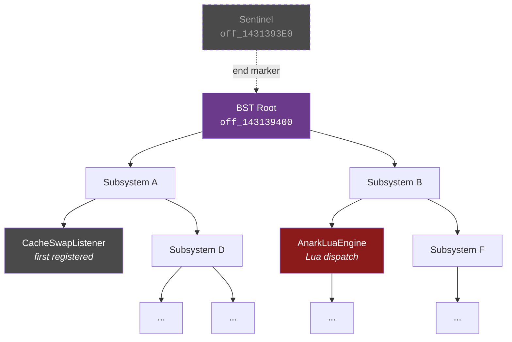
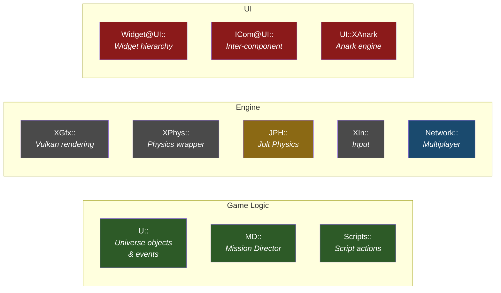
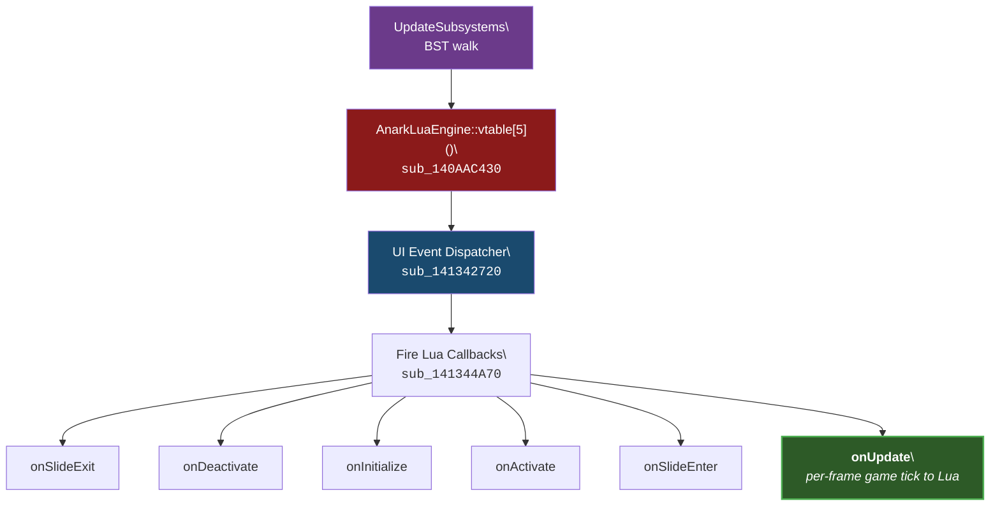
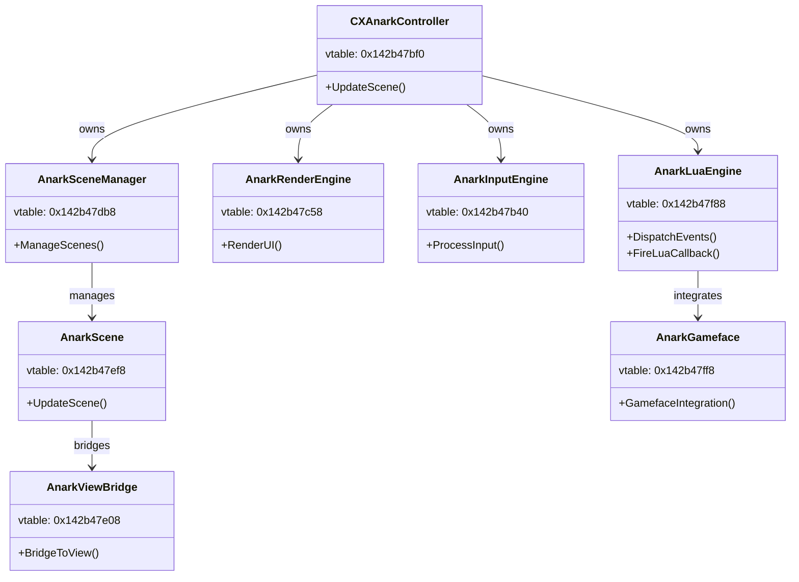
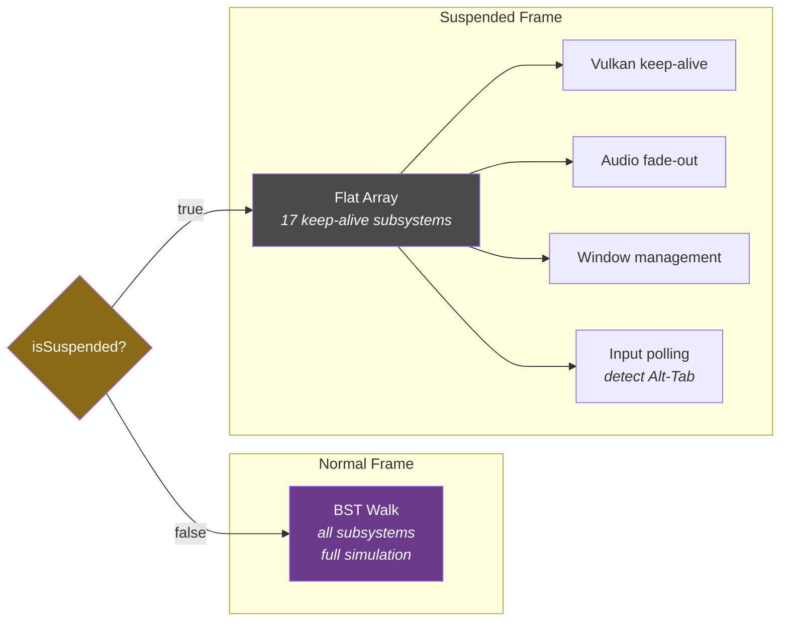

# X4 Subsystem Architecture — Reverse Engineering Notes

> **Binary:** X4.exe v9.00 (build 900) · **Date:** 2026-03
>
> All addresses are absolute (imagebase `0x140000000`). Subtract imagebase to get RVA.

---

## 1. Summary

X4's simulation is driven by a **binary search tree (BST) of subsystem objects**. Each frame, `UpdateSubsystems` (`sub_140E999D0`) walks this tree and calls each subsystem's virtual update method. This single mechanism powers all game logic — MD cues, AI, UI, events, trade, combat — everything.

---

## 2. BST Structure



> The tree structure above is illustrative — actual node ordering depends on registration order and BST key comparisons. The walk is in-order (left → node → right).

### Globals

| Address | Purpose |
|---------|---------|
| `off_143139400` | BST root pointer |
| `off_1431393E0` | BST sentinel / end node |

### Node Layout

Each BST node is a subsystem object with a vtable. The tree is walked in-order (left → node → right), and each node's update is dispatched via:

```c
node->vtable[1](node);   // offset +8 in vtable
```

### Known Subsystem — CacheSwapListener

The first subsystem registered into the BST is `CacheSwapListener` (identified via RTTI). This is a low-level cache management subsystem that runs before any game logic.

---

## 3. Update Dispatch (sub\_140E999D0)

### Function: UpdateSubsystems

**Address:** `0x140E999D0` (RVA `0xE999D0`)

This is the entire game simulation in a single function call:

```c
void UpdateSubsystems() {
    // Thread safety check
    if (is_main_thread()) {           // TLS + 0x788
        // Normal path: walk BST, call each subsystem
        Node* node = bst_first(root);
        while (node != sentinel) {
            node->vtable[1](node);    // subsystem update
            node = bst_next(node);
        }
    } else {
        // Cross-thread path (should never happen in practice)
        EnterCriticalSection(&cs);
        signal_main_thread();
        WaitForSingleObject(event, INFINITE);
        LeaveCriticalSection(&cs);
    }
}
```

### Normal Frame vs Suspended Frame

| Mode | Update Mechanism | What Runs |
|------|-----------------|-----------|
| **Normal** (`!isSuspended`) | Full BST walk via `sub_140E999D0` | All subsystems — game logic, AI, MD, UI, events |
| **Suspended** (`isSuspended`) | Flat array of 17 subsystems at `qword_146C6B9A0 + 136` | Keep-alive only — minimal rendering, no simulation |

The suspended-mode array is a separate data structure from the BST. It contains only the subsystems needed to keep the Vulkan renderer alive when the game is minimized or lost focus.

---

## 4. RTTI Namespace Map

RTTI type information strings recovered from the binary reveal the engine's namespace organization:



### Game Logic Namespaces

| Namespace | Purpose | Examples |
|-----------|---------|----------|
| `U::` | **Game universe objects and events** | `U::MoneyUpdatedEvent`, `U::UnitDestroyedEvent`, `U::UniverseGeneratedEvent`, `U::UpdateTradeOffersEvent`, `U::UpdateBuildEvent`, `U::UpdateZoneEvent` |
| `MD::` | **Mission Director** | MD cue processing, condition evaluation, script actions |
| `Scripts::` | **Script actions** | Implementations of MD/AI script commands |

### Engine Namespaces

| Namespace | Purpose | Examples |
|-----------|---------|----------|
| `XGfx::` | **Graphics / rendering** | Vulkan pipeline, shader management |
| `XPhys::` | **Physics** | Physics simulation wrapper | 
| `JPH::` | **Jolt Physics** | `JobSystem@JPH@@` — physics thread pool |
| `XIn::` | **Input** | Keyboard, mouse, gamepad handling |
| `Network::` | **Networking** | Multiplayer, Venture online |

### UI Namespaces

| Namespace | Purpose | Key Classes |
|-----------|---------|-------------|
| `Widget@UI::` | **UI widgets** | Widget hierarchy, layout |
| `ICom@UI::` | **UI communication** | Inter-component messaging |
| `UI::XAnark` | **Anark UI engine** | See class hierarchy below |

---

## 5. AnarkLuaEngine — The Lua Bridge Subsystem

The Anark UI engine is the subsystem responsible for all Lua execution. It sits within the BST and is called each frame as part of the subsystem walk.

### Vtable: `0x142b47f88`

| Index | Address | Purpose |
|-------|---------|---------|
| `[0]` | `0x140AABA60` | Destructor or base method |
| `[1]` | `0x141342080` | String/memory management |
| `[2]` | `0x1413423C0` | — |
| `[3]` | `0x141342050` | — |
| `[4]` | `0x141342920` | — |
| `[5]` | `0x140AAC430` | **Event dispatcher** — fires onUpdate etc. to Lua |
| `[6]` | `0x141342980` | — |
| `[7]` | `0x140AABFA0` | — |

### Dispatch Chain



### How AnarkLuaEngine Is Called

The engine is NOT called directly from code — it's called **only via vtable dispatch** from the BST walk. Cross-references to vtable[5] (`0x140AAC430`):

| Address | Location | Type |
|---------|----------|------|
| `0x142b47fb0` | AnarkLuaEngine vtable entry | Data (vtable slot) |
| `0x146cfb42c` | Runtime structure | Data |
| `0x146cfb438` | Runtime structure | Data |

No direct `call` instructions target this function — confirming it's purely a virtual dispatch target.

### Ownership



---

## 6. Event System — Typed C++ Events

Game state changes are communicated via typed event objects posted to an event bus.

### Event Posting

```c
// sub_140953650 — post_event
void post_event(EventBus* bus, Event* event) {
    // NO LOCKING — single-producer (main thread)
    bus->queue[bus->count++] = event;
}
```

### Known Event Types (from RTTI)

| Event Class | Size | Description |
|-------------|------|-------------|
| `U::MoneyUpdatedEvent` | 48 bytes | Player money changed |
| `U::UpdateTradeOffersEvent` | — | Trade offers recalculated |
| `U::UpdateBuildEvent` | — | Construction state changed |
| `U::UpdateZoneEvent` | — | Zone ownership/state changed |
| `U::UnitDestroyedEvent` | — | Entity destroyed |
| `U::UniverseGeneratedEvent` | — | Universe generation complete |

### Event Lifecycle

```mermaid
sequenceDiagram
    participant CODE as Game Code / Extension
    participant MEM as Game Memory
    participant ALLOC as Pool Allocator
    participant BUS as Event Bus
    participant SU as UpdateSubsystems
    participant SUB as Subsystem Handlers

    rect rgb(45, 90, 39)
    Note over CODE,BUS: Frame N
    CODE->>MEM: Modify state directly
    CODE->>ALLOC: Allocate event (e.g. 48 bytes)
    ALLOC-->>CODE: Event object
    CODE->>CODE: Set vtable (U::MoneyUpdatedEvent)
    CODE->>CODE: Fill payload fields
    CODE->>BUS: post_event() — NO LOCK
    end

    rect rgb(30, 74, 110)
    Note over SU,SUB: Frame N+1
    SU->>BUS: Drain event queue
    BUS->>SUB: Dispatch to handlers
    Note over SUB: UI reacts<br/>MD cues trigger<br/>AI adapts
    end
```



---

## 7. Suspended-Mode Subsystems

When `isSuspended == true`, the BST walk is skipped. Instead, a flat array of 17 subsystems is iterated:



**Location:** `qword_146C6B9A0 + 136`

These subsystems keep the engine alive without running game logic:
- Vulkan keep-alive (prevent device lost)
- Audio fade-out
- Window management
- Input polling (to detect Alt-Tab back)

The exact identity of all 17 subsystems has not been determined — runtime analysis would be needed to enumerate them.

---

## 8. Component System

Entity lookup uses a global component system:

**Global:** `qword_146C6B940` — component system root

```c
// Reconstructed from CreateOrder3 decompilation
void* lookup_component(uint64_t component_id) {
    // Direct lookup via component system — NO LOCKING
    return component_table[component_id];
}
```

This is the same system used by all exported functions that take entity/component IDs. It's a flat lookup table — no tree traversal, no hash map, just index-based access (extremely fast, no allocation).

---

## 9. Function Reference

| Name | Address | RVA | Purpose |
|------|---------|-----|---------|
| UpdateSubsystems | `0x140E999D0` | `0xE999D0` | BST walk — entire game simulation |
| AnarkLuaEngine dispatch | `0x140AAC430` | `0xAAC430` | Vtable[5] — Lua event dispatch |
| UI Event Dispatcher | `0x141342720` | `0x1342720` | Fires onUpdate etc. |
| Fire Lua Callback | `0x141344A70` | `0x1344A70` | lua_getfield + lua_pcall |
| Event bus post | `0x140953650` | `0x953650` | Post event (no lock) |
| sub_1409A4830 | `0x1409A4830` | `0x9A4830` | NewGame world init (called by U::NewGameAction) |
| GameStartDB::Import | `0x1409D39B0` | `0x9D39B0` | Parses gamestart XML, reads nosave attribute |
| sub_14088D4B0 | `0x14088D4B0` | `0x88D4B0` | Galaxy creation from gamestart XML |
| BST root | `0x143139400` | — | Subsystem tree root pointer |
| BST sentinel | `0x1431393E0` | — | Subsystem tree end node |
| Suspended array | `0x146C6B9A0 + 136` | — | 17 keep-alive subsystems |
| Component system | `0x146C6B940` | — | Entity lookup table |
| IsNewGame sentinel | `0x143C97650` | — | Global: 0 = new game, non-zero = save ID |
| U::NewGameAction RTTI | `0x1431c50b8` | — | RTTI for the new-game action object |
| nosave string | `0x142b37f68` | — | Literal "nosave" parsed by GameStartDB::Import |

---

## 10. World Initialization — NewGame vs. Load

X4 has exactly two paths that initialize a live game world. Both end at the same point (`U::UniverseGeneratedEvent` → `on_game_loaded`) and are indistinguishable to code running after that event fires.

### Global: `qword_143C97650` — IsNewGame Sentinel

**Address:** `0x143C97650`

This global is the single bit the engine uses to distinguish new games from loaded saves:

```c
bool IsNewGame() {
    return qword_143C97650 == 0;
}
```

- Set to **`0`** by `NewGame()` path (new session)
- Set to **non-zero** (the save ID) by `GameClass::Load()` path

`NotifyUniverseGenerated` checks this to decide whether to run new-game post-init logic vs. load-game restore logic.

### Path A — NewGame (sub_1409A4830)

Called via `NewGame(modulename, numparams, params)` (exported from X4.exe):

```
NewGame("x4online_client", 0, nullptr)
  → U::NewGameAction posted to engine action queue
  → Next frame: sub_1409A4830 runs
    → GUID allocated for session
    → qword_143C97650 = 0          // IsNewGame() = true
    → Physics subsystem reset
    → Galaxy created from gamestart XML (sub_14088D4B0)
    → MD starts, fires event_universe_generated
  → U::UniverseGeneratedEvent posted
  → AnarkLuaEngine processes event
  → X4Native fires on_game_loaded
```

**`U::NewGameAction` RTTI:** `0x1431c50b8`

### Path B — GameClass::Load

Called via `Load(filename)` to deserialize an existing save (`.xml.gz` or `.xml`):

```
GameClass::Load("save01.xml.gz")
  → UniverseClass::Import() — reads XML tree
  → qword_143C97650 = save_id    // IsNewGame() = false
  → Player, entities, economy, factions all restored from file
  → U::UniverseGeneratedEvent posted
  → on_game_loaded fires
```

### Gamestart XML — nosave Attribute

A gamestart definition in `libraries/gamestarts/*.xml` drives Path A. The `nosave="1"` attribute suppresses all autosave triggers for that session:

- **String address:** `0x142b37f68` — the literal `"nosave"` string
- **Parsed by:** `GameStartDB::Import` at `0x1409D39B0`

Extensions place custom gamestarts in `extension/libraries/gamestarts/` — X4 auto-scans all active extensions' `libraries/` directories.

### SetCustomGameStartPlayerPropertySectorAndOffset

Before calling `NewGame`, the starting sector and position can be pre-configured:

```cpp
SetCustomGameStartPlayerPropertySectorAndOffset(
    gamestart_id,    // e.g. "x4online_client"
    property_name,   // e.g. "player"
    entry_id,        // e.g. "entry0"
    sector_macro,    // MACRO NAME string (e.g. "Cluster_01_Sector001_macro") — NOT UniverseID
    pos              // UIPosRot
);
```

Note: takes the sector **macro name** string, not a `UniverseID`.

---

## 11. Related Documents

| Document | Contents |
|----------|----------|
| [GAME_LOOP.md](GAME_LOOP.md) | Frame tick, timing, render pipeline |
| [THREADING.md](THREADING.md) | Thread map, main-thread proof |
| [STATE_MUTATION.md](STATE_MUTATION.md) | API function safety analysis |
